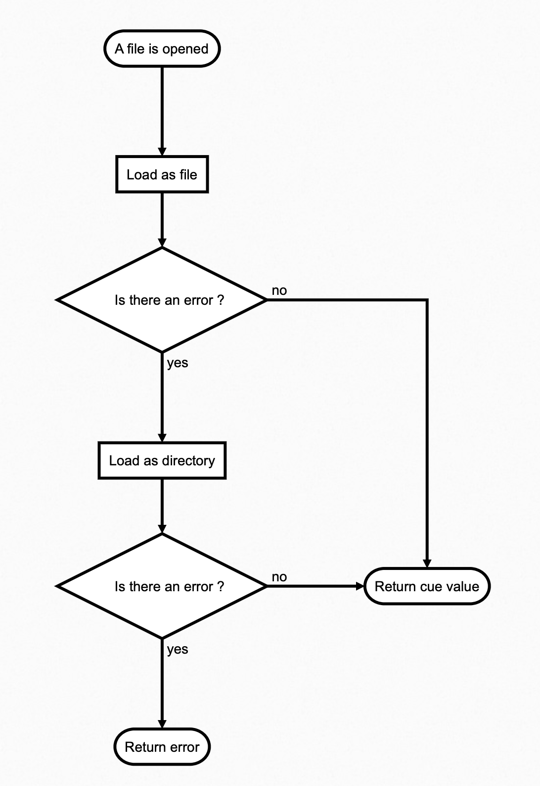

# How DLSP load CUE ?

## Theory

Even if DLSP works with raw CUE, he unleashes his capabilities when used with Dagger.

One big challenge of CUE is to know how load the current file. There are 2 ways:

- As a directory
- As a simple file

As you would split your Go package for organization purposes, you can write multiple CUE files in the same directory and
then merge everything at evaluation.
**BUT** with Dagger, you can also create multiples plans in a same directory that must be evaluated one by one.  
As an example, see our [docker tests](https://github.com/dagger/dagger/tree/main/pkg/universe.dagger.io/docker/test).

```
tree -P "*.cue" -I "testdata"
.
├── build.cue
├── dockerfile.cue
├── image.cue
└── run.cue
```

:bulb: A _plan_ is a file that contains a `dagger.#Plan` definition. For more information,
see [official documentation](https://docs.dagger.io/1202/plan).

On the other side, DLSP must work when you want to develop new definitions that are not part of a `dagger.#Plan`, for
instance if you want to create your own [reusable action](https://docs.dagger.io/1239/making-reusable-package).

So we have a problem : how to load the plan?

## Practice

First, it is not possible to just load the content of the opened file: if there are imported definition inside, we would
not be able to load the corresponding CUE value. It is the same for keys/definitions in other files of the directory. So
it's mandatory to **load from user's filesystem**.

Then it's straightforward, if there is something from an external file, trying to load plan as a file will fail.

So what we do is simple :



## :warning: Limitation

Some plans can work alone even if they are supposed to be merged during usage.  
That should not affect usability of DLSP for now, but if it does, feel free to open an issue, so we can prioritize this
problem